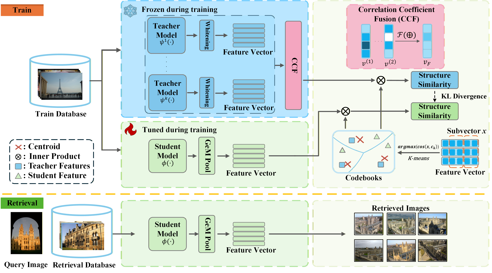

Official implementation of "Correlation Guided Multi-Teacher Distillation for Lightweight Image Retrieval". 

# Correlation Guided Multi-Teacher Distillation for Lightweight Image Retrieval


Official PyTorch implementation of the paper **"Correlation Guided Multi-Teacher Distillation for Lightweight Image Retrieval"**.[Code coming soon]


## ✨ Highlights

- **🤝 Multi-Teacher Correlation Fusion** Unlike naive averaging, our mechanism measures the correlation between teachers to adaptively weight their contributions, effectively filtering out noise and conflicting information.

- **📐 Cosine-based PQ** We utilize **Cosine-based Product Quantization** to provide structural similarity supervision, ensuring better directional semantic alignment for the student model.

- **🚀 Teacher-Free Inference** The student model learns robust representations, enabling **symmetric retrieval** without relying on the teacher at inference time. This eliminates the computational burden of heavy teacher models.

- **📈 SOTA Performance** Our method achieves significant improvements on large-scale benchmarks with 1M distractors:
  - **ROxford (+1M):** ⬆️ **+7.9%** (Medium) / ⬆️ **+9.0%** (Hard)
  - **RParis (+1M):** ⬆️ **+3.3%** (Medium) / ⬆️ **+6.6%** (Hard)

- **⚡ High Efficiency** By removing the teacher dependency during retrieval, our method achieves **48.83× faster** inference speed compared to asymmetric retrieval methods.

## 🛠️ Method
The overall framework of our proposed CGD method is illustrated below:


<div align="center">
  Figure 1: Overview of the Correlation Guided Multi-Teacher Distillation framework.
</div>

## 📊 Main Results
Our method achieves state-of-the-art performance on standard benchmarks while maintaining low computational cost.

### 📊 Main Results

Performance comparison on standard benchmarks (ROxford and RParis).
> **Note:** † denotes the asymmetric retrieval setting (Query by Student, Database by Teacher).

| Method | Backbone | Params (M) | ROxf (M) | ROxf (H) | RPar (M) | RPar (H) | ROxf+1M (M) | ROxf+1M (H) | RPar+1M (M) | RPar+1M (H) |
| :--- | :--- | :---: | :---: | :---: | :---: | :---: | :---: | :---: | :---: | :---: |
| **Ours†** | MobileNetV2 | 4.8 | 84.74 | 67.82 | 91.80 | 83.62 | 79.91 | 58.85 | 82.21 | 67.78 |
| **Ours†** | EfficientNetB3| 11.5 | 85.48 | 68.71 | 91.98 | 83.46 | 80.70 | 59.74 | 82.54 | 68.48 |
| | | | | | | | | | | |
| **Ours** | MobileNetV2 | 4.8 | 80.99 | 61.91 | 89.78 | 79.02 | 75.16 | 50.77 | 78.16 | 59.44 |
| **Ours** | EfficientNetB3| 11.5 | 82.38 | 64.37 | 90.44 | 80.19 | 77.83 | 53.63 | 81.31 | 63.59 | 

> **Note:** The pre-trained weights can be downloaded from the links in **[https://drive.google.com/drive/folders/1mAZppSYGbGe7OL-EnK0_uG13j2RYD1ls?usp=sharing]** .

## 🔨 Installation
```bash
git clone [https://github.com/ban0329/CGD.git](https://github.com/ban0329/CGD.git)
cd CGD
pip install -r requirements.txt
